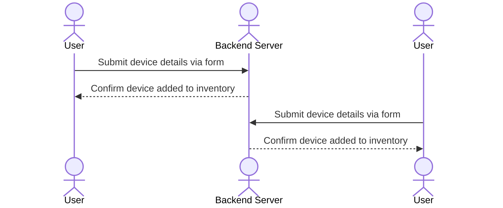

# Jobs&Inventory

Jobs & Inventory is a simple yet powerful web application designed to help companies efficiently manage their resources and job assignments in one centralized platform. It simplifies the process of tracking company devices, tools, and equipment while also monitoring active projects and job statuses. By providing a real-time view of both inventory and operations, Jobs & Inventory ensures that businesses track their inventory devices while managing efficency.

### Elevator pitch

Managing company assets and job assignments can quickly become a logistical nightmare, leading to lost productivity and costly mistakes. Jobs & Inventory is here to solve that. With a sleek, intuitive interface, this powerful web application allows businesses to seamlessly track every company device, tool, or equipment, alongside all current job assignments. Whether you’re monitoring inventory turnover or managing employee tasks in real-time, Jobs & Inventory provides a unified platform that ensures efficiency, transparency, and control. Empower your team to work smarter and make informed decisions with an all-in-one solution that scales with your business needs.

### Design

The website will consist of three primary pages: Login, Home, and Add. Each page serves distinct functionalities:

    Login Page: This page ensures the security of the website by requiring users to authenticate before gaining access. Below the sign-in form, an API will display inspirational quotes from church leaders, reminding users of the values and mission they represent.

    Home Page: The central hub of the site. On the left side, users will find an inventory list, while the middle section will display a list of available jobs. The right side will feature an overview of who is currently signed in (team members) and include a simple chat function for team collaboration. This chat feature will allow users to assign tasks, communicate responsibilities, and coordinate efforts in real-time.

    Add Page: This page provides a form for users to add new devices and equipment to the inventory, allowing for easy updates and accurate tracking of resources. 
    

Here is a sequence diagram that shows how to people would interact with the backend to add devices to inventory.

### Key features

- Secure login over HTTPS
- Ability to select the question to decide
- Display of choices
- Ability to select, and change, top three choices
- Totals from all users displayed in realtime
- Ability for a user to lock in their top three
- Results are persistently stored
- Ability for admin to create and delete questions

### Technologies

I am going to use the required technologies in the following ways.

- **HTML** - Uses correct HTML structure for application. Two HTML pages. One for login and one for voting. Hyperlinks to choice artifact.
- **CSS** - Application styling that looks good on different screen sizes, uses good whitespace, color choice and contrast.
- **React** - Provides login, choice display, applying votes, display other users votes, and use of React for routing and components.
- **Service** - Backend service with endpoints for:
  - login
  - retrieving choices
  - submitting votes
  - retrieving vote status
- **DB/Login** - Store users, choices, and votes in database. Register and login users. Credentials securely stored in database. Can't vote unless authenticated.
- **WebSocket** - As each user votes, their votes are broadcast to all other users.

## HTML deliverable

- [ ] **HTML pages** 
- [ ] **Links** 
- [ ] **Text** 
- [ ] **Images** 
- [ ] **DB/Login** 
- [ ] **WebSocket** 

## CSS deliverable

- [ ] **Header, footer, and main content body**
- [ ] **Navigation elements** 
- [ ] **Responsive to window resizing** 
- [ ] **Application elements** 
- [ ] **Application text content** 
- [ ] **Application images** 

## React deliverable

- [ ] **Bundled and transpiled** 
- [ ] **Components** 
  - [ ] **login** 
  - [ ] **database** 
  - [ ] **WebSocket**
  - [ ] **application logic** 
- [ ] **Router** 
- [ ] **Hooks** 

## Service deliverable

- [ ] **Node.js/Express HTTP service** 
- [ ] **Static middleware for frontend** 
- [ ] **Calls to third party endpoints**
- [ ] **Backend service endpoints** 
- [ ] **Frontend calls service endpoints** 

## DB/Login deliverable

- [ ] **MongoDB Atlas database created** 
- [ ] **Stores data in MongoDB** 
- [ ] **User registration** 
- [ ] **existing user** 
- [ ] **Use MongoDB to store credentials** 
- [ ] **Restricts functionality**

## WebSocket deliverable

- [ ] **Backend listens for WebSocket connection** 
- [ ] **Frontend makes WebSocket connection** 
- [ ] **Data sent over WebSocket connection** 
- [ ] **WebSocket data displayed** 
