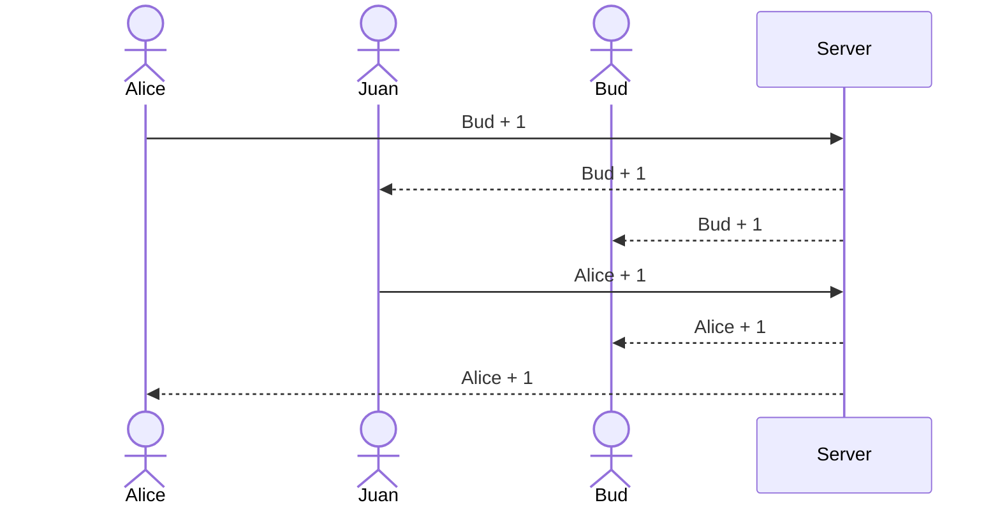

# Jobs&Inventory

This application serves as an example for the information you must provide in your Start Up `README.md` file for each phase of your development. You only need to fill in the section for the deliverable when you submit that deliverable in Canvas. This allows the TA to know what should be graded.

The specification deliverable section defines what your application will do. The rest of the deliverable sections reference the rubric for the deliverable and tell where the functionality is in your application, or documents that you did not satisfy that part of the rubric.

## Specification Deliverable

➡️ The following is an example of the required information for the `Startup Specification` deliverable

### Elevator pitch

Have you ever endlessly debated with your friends about where to meet for lunch, or had your team bog down about an important decision that needs to be made. The Voting application makes it so a group of people can pull out their phones, clearly see the options, and pick their top three choices. As each user makes their choices the results are automatically tallied and displayed in realtime to all the other group members. Once everyone locks in their choices the group can move forward with confidence that the best option has been selected.

### Design

Here is a sequence diagram that shows how to people would interact with the backend to vote.

### Key features

- Secure login over HTTPS
- Ability to select the question to decide
- Display of choices
- Ability to select, and change, top three choices
- Totals from all users displayed in realtime
- Ability for a user to lock in their top three
- Results are persistently stored
- Ability for admin to create and delete questions

### Technologies

I am going to use the required technologies in the following ways.

- **HTML** - Uses correct HTML structure for application. Two HTML pages. One for login and one for voting. Hyperlinks to choice artifact.
- **CSS** - Application styling that looks good on different screen sizes, uses good whitespace, color choice and contrast.
- **React** - Provides login, choice display, applying votes, display other users votes, and use of React for routing and components.
- **Service** - Backend service with endpoints for:
  - login
  - retrieving choices
  - submitting votes
  - retrieving vote status
- **DB/Login** - Store users, choices, and votes in database. Register and login users. Credentials securely stored in database. Can't vote unless authenticated.
- **WebSocket** - As each user votes, their votes are broadcast to all other users.

## HTML deliverable

- [ ] **HTML pages** 
- [ ] **Links** 
- [ ] **Text** 
- [ ] **Images** 
- [ ] **DB/Login** 
- [ ] **WebSocket** 

## CSS deliverable

- [ ] **Header, footer, and main content body**
- [ ] **Navigation elements** 
- [ ] **Responsive to window resizing** 
- [ ] **Application elements** 
- [ ] **Application text content** 
- [ ] **Application images** 

## React deliverable

- [ ] **Bundled and transpiled** 
- [ ] **Components** 
  - [ ] **login** 
  - [ ] **database** 
  - [ ] **WebSocket**
  - [ ] **application logic** 
- [ ] **Router** 
- [ ] **Hooks** 

## Service deliverable

- [ ] **Node.js/Express HTTP service** 
- [ ] **Static middleware for frontend** 
- [ ] **Calls to third party endpoints**
- [ ] **Backend service endpoints** 
- [ ] **Frontend calls service endpoints** 

## DB/Login deliverable

- [ ] **MongoDB Atlas database created** 
- [ ] **Stores data in MongoDB** 
- [ ] **User registration** 
- [ ] **existing user** 
- [ ] **Use MongoDB to store credentials** 
- [ ] **Restricts functionality**

## WebSocket deliverable

- [ ] **Backend listens for WebSocket connection** 
- [ ] **Frontend makes WebSocket connection** 
- [ ] **Data sent over WebSocket connection** 
- [ ] **WebSocket data displayed** 
