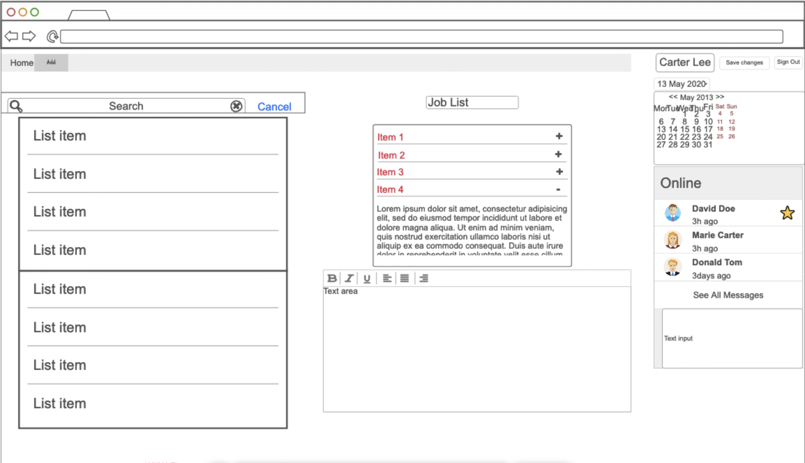
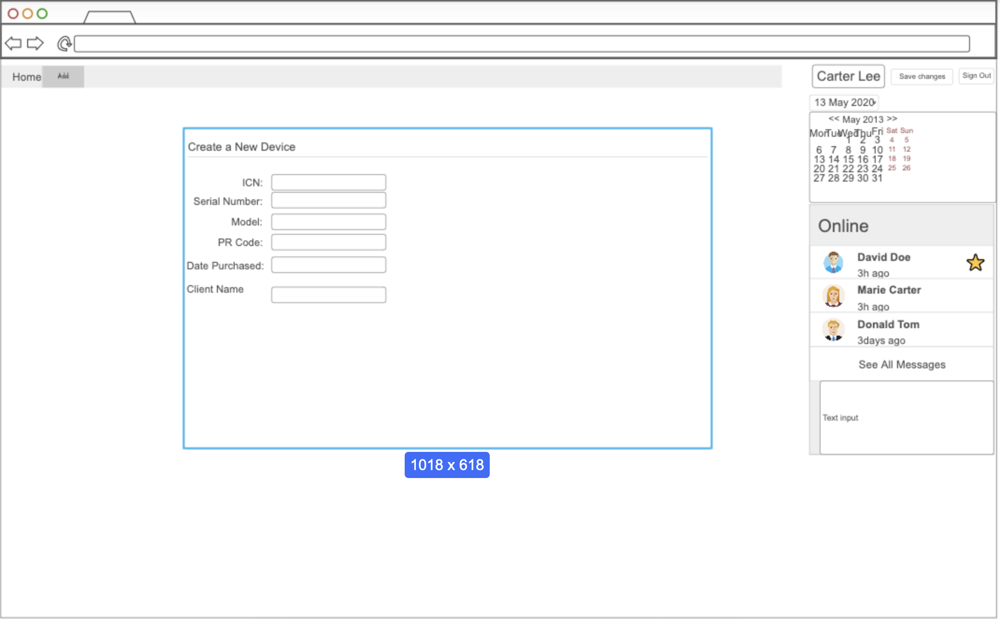

# Jobs&Inventory

Jobs & Inventory is a simple yet powerful web application designed to help companies efficiently manage their resources and job assignments in one centralized platform. It simplifies the process of tracking company devices, tools, and equipment while also monitoring active projects and job statuses. By providing a real-time view of both inventory and operations, Jobs & Inventory ensures that businesses track their inventory devices while managing efficency.

### Elevator pitch

Managing company assets and job assignments can quickly become a logistical nightmare, leading to lost productivity and costly mistakes. Jobs & Inventory is here to solve that. With a sleek, intuitive interface, this powerful web application allows businesses to seamlessly track every company device, tool, or equipment, alongside all current job assignments. Whether you’re monitoring inventory turnover or managing employee tasks in real-time, Jobs & Inventory provides a unified platform that ensures efficiency, transparency, and control. Empower your team to work smarter and make informed decisions with an all-in-one solution that scales with your business needs.

### Design 
The website will consist of three primary pages: Login, Home, and Add. Each page serves distinct functionalities:

### Mock Drawings

Login Page: This page ensures the security of the website by requiring users to authenticate before gaining access. Below the sign-in form, an API will display inspirational quotes from church leaders, reminding users of the values and mission they represent.
    
Home Page: The central hub of the site. On the left side, users will find an inventory list, while the middle section will display a list of available jobs. The right side will feature an overview of who is currently signed in (team members) and include a simple chat function for team collaboration. This chat feature will allow users to assign tasks, communicate responsibilities, and coordinate efforts in real-time.

Add Page: This page provides a form for users to add new devices and equipment to the inventory, allowing for easy updates and accurate tracking of resources.

#### Login Page

#### Home Page

#### Add Page

Here is a sequence diagram that shows how to people would interact with the backend to add devices to inventory.

### Key features

- Secure Login over HTTPS: Ensures that only authorized users can access the system, protecting sensitive data and functionality.

- Inventory Management: The Home page provides a list of inventory items, allowing users to view available devices and equipment.

- Job Management: Users can view a list of available jobs and tasks, helping them understand the work that needs to be completed.

- Team Member Overview: Displays a list of users who are currently logged in, facilitating better team coordination.

- Real-Time Chat: Includes a simple chat feature for team members to assign tasks, communicate responsibilities, and collaborate on job assignments.

- Add Devices: Provides a form for users to add new devices and equipment to the inventory, ensuring that the inventory is always up-to-date.

- Admin Functionality: Allows administrators to manage the inventory by adding or removing devices and overseeing the job listings.

### Technologies

I am going to use the required technologies in the following ways.

- **HTML** - Uses correct HTML structure for application. 3 HTML pages. One for login and one to show inventory and jobs and one for adding devices to inventory. Hyperlinks to choice artifact.
- **CSS** - Application styling that looks good on different screen sizes, uses good whitespace, color choice and contrast.
- **React** -
  - Login: React will handle user authentication, dynamically displaying error messages or confirmations.
  - Inventory & Job Display: React components will be used to dynamically load the list of jobs and inventory items. These components will allow users to view, filter, and interact with jobs and inventory in real-time.
  - Chat & Team View: A React component will show a list of signed-in users and allow team members to chat, assign tasks, and collaborate within the app.
  - Routing: React Router will manage navigation between the Login, Home, and Add pages, ensuring a smooth user experience
- **Service** - Backend service with endpoints for:
  - Login Endpoint: Handles user authentication and ensures access control.
  - Get Inventory/Jobs Endpoint: Retrieves the latest job listings and inventory details for display on the Home page.
  - Add Device Endpoint: Accepts form submissions from the Add page to update the inventory with new devices.
  - Chat & User List Endpoint: Fetches and updates the list of signed-in users and manages real-time chat functionality.
- **DB/Login** - A secure database will store user credentials, job data, and inventory information.
  - User Registration & Login: User data (e.g., credentials) will be securely stored and managed in the database, ensuring only authenticated users can log in and interact with the system.
  - Inventory and Jobs Storage: All inventory items and job tasks will be stored in the database, enabling the application to easily retrieve and update records as needed.
- **WebSocket** -
  - Chat Feature: The chat component will use WebSockets to provide real-time communication between users, enabling them to discuss tasks and assignments without needing to refresh the page.
  - User Presence Updates: WebSockets will also be used to broadcast which users are currently signed in or active on the website.

## HTML deliverable

- [x] **HTML pages** Built 3 pages called Login, Home, Add Page, and about
- [x] **Links** Created a link to my github page and linked all pages 
- [x] **Text** Wrote in my about page about Jobs&Inventory
- [x] **Images** I added a picture of Hawaii to my about page because I am from Hawaii
- [x] **DB/Login** I created a login page with the form however it doesn't work not linked to the database
- [x] **WebSocket** I have a chatroom where team members can work together and in real time communicate with each other and other users can see who is on the page.
- [x] **API** On my about page I have a quote section that acts as my placeholder that I will link to a qoute API and that will display inspirational qoute to uplift 

## CSS deliverable

- [x] **Header, footer, and main content body**  Flexbox to position navigation and content, ensuring it stays fixed in height and adapts across screen sizes and added a color palette 
- [x] **Navigation elements** Styled navigation links with Flexbox, ensuring they align properly, and used media queries to adapt to smaller screens and consistant across all pages
- [x] **Responsive to window resizing** Implemented media queries to adjust layout properties like font size, padding, and width to make the design responsive.
- [x] **Application elements** Styled content containers like inventory and job lists with Flexbox, borders, and shadows for visual separation, while using responsive widths.
- [x] **Application text content** Styled text elements with font-size, spacing, and color to ensure readability and alignment within their containers.
- [x] **Application images** Set responsive image rules in about.css using max-width and height properties to ensure images scale correctly in different screen sizes

## React deliverable

- [x] **Bundled and transpiled** I used Vite as a bundler to compile my React code, along with other assets, into a production-ready format for deployment.
- [x] **Components** I structured my app into reusable components like Login, Home, and Authenticated to manage the different parts of the UI and their functionality
  - [x] **login** Login component handles user authentication by accepting username and password inputs and managing the transition between logged in and logged out states.
  - [x] **database** I store user data in localStorage so that when a user logs in, their userName is persisted and passed down to components as needed.
  - [x] **WebSocket** I simulate real-time behavior in the chat feature by updating messages and active users periodically, mimicking WebSocket-like functionality.
  - [x] **application logic** I use functions like onLogin, onAuthChange, and setUserName to control the flow of authentication and manage UI changes based on whether the user is logged in or not.
- [x] **Router**  I implemented React Router to handle navigation between different views in my website, such as Home, Add, and About, using NavLink and Route components.
- [x] **Hooks** I utilized React hooks like useState to manage state (for example, userName and authState) and useEffect to handle side effects, like updating the list of active users at regular intervals.

## Service deliverable

- [ ] **Node.js/Express HTTP service** 
- [ ] **Static middleware for frontend** 
- [ ] **Calls to third party endpoints**
- [ ] **Backend service endpoints** 
- [ ] **Frontend calls service endpoints** 

## DB/Login deliverable

- [ ] **MongoDB Atlas database created** 
- [ ] **Stores data in MongoDB** 
- [ ] **User registration** 
- [ ] **existing user** 
- [ ] **Use MongoDB to store credentials** 
- [ ] **Restricts functionality**

## WebSocket deliverable

- [ ] **Backend listens for WebSocket connection** 
- [ ] **Frontend makes WebSocket connection** 
- [ ] **Data sent over WebSocket connection** 
- [ ] **WebSocket data displayed** 
